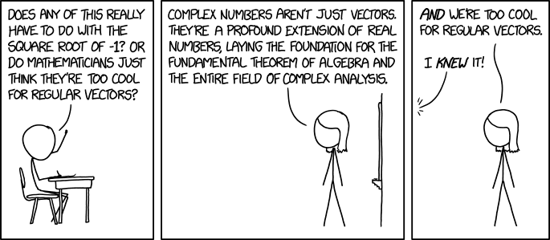

:title: La cartographie c'est simple et *complex*
:author: Julien Tayon (Logilab)
:description: Comment faire sa carte
:keywords: SVG, python, cartographie
:css: res/custom.css

.. header::

    .. raw:: html
        
        <img alt="princess_twilight_trotting_by_botchan_mlp-d5whtyo" src="data:image/gif;base64,R0lGODlhbgBkANUOAAAAAAAiVTMzdzNEd2YiiDPM/4hVmYh3mZlmqv9Eme5VqqqIzMyq3f///zPM/wAAAAAAAAAAAAAAAAAAAAAAAAAAAAAAAAAAAAAAAAAAAAAAAAAAAAAAAAAAAAAAAAAAAAAAAAAAAAAAAAAAAAAAAAAAAAAAAAAAAAAAAAAAAAAAAAAAAAAAAAAAAAAAAAAAAAAAAAAAAAAAAAAAAAAAAAAAAAAAAAAAAAAAAAAAAAAAAAAAAAAAAAAAAAAAADPM/yH/C05FVFNDQVBFMi4wAwEAAAAh+QQJBAAOACwEABQAYgBOAAAI/gAdCBxIsKDBgwgTKjyIoKFDhAIEBJhIkaBDBAszatzIceDFhhAlUpxo8WHHkyg3NmTAkgFIBxFHTiRAk0DMACtdYkzJs2fBnCxf3hxZ06bInC99Kk0JVOfIiFChJkhAM+eCBSSXau3YtOHTqFKpErCKNcDWswvJBkUAti1YllejZkVL1yMCuAvWut0rAK9cs3UDI73b8itfqFeLzg2MdnBLBoYPC0hcczHjrY4fQw4gGexUxYAva838eGLnqJ8rhxattKnmzac9i7XMmqdrzaZjh6VJuzbKAQNeAxgOILduAVNT9/a9Ebhw4sZ1J5+9mnlH4LdZfiUO4HVS61ux/hN+vZ24953gt05syr1BAwMGhrt3P/zx9/RK149n0P59fADzNVBfS/fh15N+r7HkHnzccWcfegb6hGCCC/7XYHcEQsiYTDJJiNN+j1XY34Br1cbhSB5mx4CIxNGHYYmBRdYWiidNJF6CK/p34YMFLiUjWDR2ZOMAKrLoYIY9pvTjdFPNWN1CQ942YIAunqceRW0xmYCTQgZwo2ZTUklihj5yJpuWWv6V0UwEfIkjjl1pqKSZqKGZJlTLEcSmm2+e96CHWTJZ1KAENCnSmgHw9mGffV5UZqDTEVqUoXkOxOaEjCbo6IF0hpUaTYfRNNVHJumZaJtEgogkqaXm12lE/pHWFGqhCbAq556pwmlrqzxFB2tyoPL1VVWEXbXWRbiqmOSVkIp12LBjFZuXTsieyuefMb66m6xAVmQpRQ0Zy4C4g13UqJzMuvWpUX8tNlK405JLGKnn1uWrp852m9FF8vrJ6LKc7hUrl2k51K9mKmKL1r2/pqamRoMdvFamAPeqbcP53qTSvAhIrBPF6AasLrDsHspRTqM69GCmMKbbbLAan0xYynGyrNPCFyNHcsxc7TfVsarqam/OA5vc82M/Uxu0piFbfNi6PMvsXtJTuWdzy1oxvG2wlSLU0NQJsFR1A1fffJbWRUe90QEHKLu0wmcTvTOeT2bEttsg4/z0/txdH8T23Uu7XfGceztsNEd/tx344oM7PbLhfRPE9lVX3WYr3EMLzHfdCU1OueWsYp7ty0ZF7oDnlC8AeklWXnZv0aaj/rmq363OWnSwcy75AalXTructouG++Z289578Ha1LnynuSsk+1WAK//T78vXCbnupxufevQIh4z8hmY277f2vbMtUJxeU397+MSP3zvl5juAPkPqm0jRurQ9D/8BrHff/4Pxs99E8Pck/UGPf8nzXwIBiEDwTEQBClCUQfQXwAWSSX6LqyBzHhhBAuSPfAc0iO3cpkHrXIpzsish3t7UkBJu8FTLSWEDLbgyFiLAhSb0FkISlz5d6Wp7TzN0oA7Hh8MVngeIERKI6XrItCOWL4jpWSL9fNi99+EwiSdJmNLgZUUoYhElWiTV+0L4xaWA7juJS6MXy5jF36FRjX9jY2tYJUfw2CpCAQEAIfkECQQADgAsBAASAGIAUAAACP4AHQgcSLCgwYMIEyo8iKChw4UJHSKASLGixYoSG14kKHGjx48QGzIYyUDjQQECAqhcKVBkyYkgY8psiYDkS4QoV7J04NLkzJ8bXY6UmFNnAAJICaB0uWAB0KdBa5IkmtJoUqUCmDqFylWh1qEIdKIcO1biyKZFu6ot+PWlWLJlHZ5dkHat3Z5SR8LdC7cp2rEq7arFa5OvYQF+6QIOILgrYZJvD49NkOBq4MZQH4+MLFkAZcuMMT8VahNygM5wPye9LFom6dIMVKImqxop69YgUcIGwBuA7Nm0KxO4jduj7tK9fZ8GPlk48eIXBwx4bZp5c9XPoUOUTn3zcuuUsf6H1m6Re14Gyd82WN+At02f5Geat5l+JUr27QG8hxl/psruDKxngAHJJbdffz/9d55NAhJYoHtT8SeYUUbJpCBsIzWY3HoQgiUahTpZGACAGvbGoX4R2sXZXiFupNJ8GJZoYITwPbUiXC1e9OJ0C5IkY2/71RjTjeGFx+J4FO1IHYT4nQibkCARWWQCR+oYAIz0odhkfk9KGOV3100pJlnZHaRkjxiWRhqULoKJkphwUrlYRWemaedLBw7ppmdTXuUnAZTVpZBKSGF5J4Yd+benmH9eFWhVEBFKgKGHqvmQnnsVeZVkSD1apkCSXohoRqTauGh4mx7WqZyfOhDqiP5ovkRqoiJmiipWhr2F1KxeunrUpDymyaaptqomma4E8GqQpJSmuNZvtqZK5k6grtQWqcwGO6qKe74pHFJH3qbTtRllC+CwmPKlKa5zLtRQU3OBBZZZdqL7pWHrVukuAvAy0C9e9Arba4Ld8mlsuyE59G+PAObJFbSp3TotRgovIK+lldrbJr4SI0wRXgvvl/HA6RYr3MQWgWwxnhGO/HDB+UIa1UiUBcyyy1BBHNzBrSLkUs1ytVzpTUDpHHGqPTN0HmXzxtrly5LVhlXSBpHGtKxOWwq1uh0LmjIC611N2XpDO0ss1wd7TXHYCdCcANllE01w1B1THVGsDWO9Nf7HPCPp0blZ05ozzHX7bdEBB1Cn+Hka34v2yTJ7hPjiXTr87Kl9S35AU4vz+vTlJoMb+eGbL9D5rJ9zuzPkdgs0edCWu5443iTPHaborTvw+uIGvS6w6rdPbThCiHPOMMnFmw673F1BHLPdyfN+UPTLN57u88MXlLzxqQ+0vV9r1l70cthD9L30BH3PvdkTriR1q+or373siaHfvkrvZ09/YvJrrX3p64sdZlSiAAXYRn+6AyD4jte70tnMQ8UhoAGHg8D42W9/D2Qebl6lEAsy8H8B9B90OJgQD84vgSEU4AapNT0F+k6EKFzgCUfIwgYm5oWWO98HEeQr8yHuAFM0+V0MU6jB+CTth0DkCe32R0Tr8dBnSxxi/yD4xJgAjolTLGIVL3LFBOrQiVuEohCRWL9LhREkXZQdEpF4RitGUY1rRFwbXcMr8c0RKHW0I2YCAgAh+QQJBAAOACwGABAAYABSAAAI/gAdCBxIsKDBgwgTKiyIoKHDhQkdIoBIsaJFiBIbXiQocaPHjwobMhjJQONBAQICqFwpUGTJiSBjynQ50qRBlCtZOnBpU6bPizRfNsSZMwCBowRQulyw4KfTjUElEs2JNKmApU2fag2JYCTTmghyohw7VqLXBUS3qmXYlcHXl2LJlnV4Nu3auzzbjpTLVy5TpmRV3lWblySDvogF/EU7VvBgrYVJxk08NkGCqo4fO408cjJlAZYxB9D8NKjhzgE+yw2NNDNpkKZPq1RNlvVR1689ojzNAIBvALNp175MAHfui7tP/waeWnhl4saPVxwwIDZq589ZR5eukLp1BsGx/lvWPpq7Re96e/+O26B9A9+Ge5qPid7wcvbu4ZOUf7eoTpAqfdeeAQYst1x8MGnm33YVBZieYQMWaKB+YA3mWWD/WeQgbyNFuFx7FL5k4UqI5eTRhhx6+BuIACC41YWfMXiQSvWl2ACBEyLIH4AkOiejQTRW9yBJKh6430M+hbfaeEzy9eNAQcamn3v5tXjajhspORyTljlZHkRRDjklle9Z6WJMWmbHZZONfblQmBzGeeSZPCK25poYNhhAjXJyGFWCWTbHF5NVFUpAlym5iZBKR/HZp59I1tkXoYYiheiTjBLg6KNXRvpRmpQehdhRlypaUKYo8pbRqoDKBOp4/lWNemgCdi1qVHEBfMdqRj+9ylqJPR61K5C3bnqkgoKqKWpfcQnLKrGNChknlr0mO1ysbbqWE1ZgSZSpsRX2Z+1z2E7l5rZtvbXqt9JCulaaKFHKF0YIvKVuW6v2SS2a48YLq1Vk0WvvAmB1S5ec+0o66L95LiTRvaoOGfG7/YLGcJv0NgRxp5wmHKidF9fqML71EvwSgh23mmTF8mJMUV4bF/yoxxfBa/GviVYUm1lzciqiVja3/GRLQ/Isc8pP2ewvtkPvlN6aRs+ssqsVL42UyFwZBvXBSAPNcsg5vzykZT676zXIOGMd0dgJlD2xU0rfTJzaWTPQHtkMWNZe/tk0a1i13Ms2TXSHDeCtdwN8T70y2nOHDZTEJ3N8ZN81f42z4APpWnR6HYm78OWm0hvxrppTTpGvjWM+eKekQ975iz36C7rOXL90wAEE3b6Y5hQrKXToB0Xd0O25H7C764pXu2XqwHO0OfEF6f7X7cInv7iyVj25MwLQF78Y9bWbfmJzv4veqUHSf4+703khKzvz5tM5UPrTr8+z+J+uZBuu8du+vkD0Y0r3nCa/Ealkf9rjHPf+54AALmCAfzrOAROgAAXcpnkNPEAEo2e8xTzQfpuTYAAsU8ELKgR8BcygBz+4uhQiizx1k58DBahB5HFngiZc29sA2MEVotBsije8lYy2570VfpB35kEVBok4vx568Ic7TGKGDMJEHhqRhQQ833wcYCIdatGKRoReFbc4xBA28YpiVOAWT7VEM4LRhyB04RqDZ8MzhpGB7Ztj/2ToRPU5L1x6jOEXVXhH5+FvPkh84xPx6KlAejGKPLydJCXpSNjUsXiTnGQlP9K6Q27SIp203nwCAgAh+QQJBAAOACwKAA4AXABUAAAI/gAdCBxIsKDBgwgTKnSAoKHDhQkdIoBIsaJFhBIbXiQocaPHjwYbMhjJQONBAQICqFwpUGTJiSBjenQ50qRBlCtZMkRQE6bMnxRpvmyIM2cAAkgJoHS5YAHQp0F5kpRYNGdSpQKYOoXKNaTUpj1zohw7VuLIpkW7qt15dkHYlWTJmmWANmWAtV1dCo3LN27TumnxAtUrdWTfwwL+LiCrUvBgqULFIiabIMHVxo5lEibJQPJklJUv380cUyjnkSo/xw2dFDPpjaZPp1Y9ljVS168tojzNAIBvALNp17ZMAHduirtP/wYeQDhl4saPLxwwIDbq5s5BV4Y+Wvr06oVl/mPPvp27d4jUhS6X3KB9A9+cbZ73mD78ergC3L8HEN8nV6NGyaSSdQy0Z4AByy3X31oA5iRgAAQaiGCC8E3l34PB9RVdRQOGx5mEy7VXYU9QeaZhdxt1yNtIIP4mIn8WYjjecOUxhiKHAdS3YoENHEhhf/JdZKJ2NY614UIq6bhiiwpaGCRFGT5X3pQJBIajkpxVqN+LvD0JUZQ0UrmdlVDmCB5vWm45YowpzkjkdlddVRmZCiV55o54CuUlkm4KQGWcSc1p15V34rminhfyyVd5Vx2GlKBHCqQSUlgaeuhDbS4KZ1KOEgDpjQVNSkCllp7W0UaasibcowlE6oCo/ipemlFGMqVK3KqetgoqQbBC6KGTs2LqEZiMYsVXg77OapCopLLZFbGbHoZssIkyW6ipiQIFbaNxOThQrGAN5ZC1BO75oKbc2ogbuG6J2xC5v5L4X5/FHrvrQA2FGy5hc+1o7kfQqtrtvS0hoG+7/Dpk6L/D0hutkQTj69C+vxK44Ly2ImUjRBJR3GW82JbosMB0RoRAe/kiHJ7Fzv4U8K0QV9QQygar3F+pDFv0ssaDRsVZZf2+VKq82o4Ms6schQe0whYO/ZLIGWOFtMQjUUkzyxdDvdrDUxdc9ZRXg/zxs0bz3DVbJFXmtL/ZxrSz1BEn/XMCa1+qddQlY3Ry/gNqM1AZzU7nLGSfb5odt8Tt9f13A1i3XPRh9fbMMcjlQkZt24NDzvXhXl/Kdk/U3h2m4TJXfHnQYz/1dt4HxXY66iFjPDrckyOq2AEHCIR7U40LXqaURx8edMpN4a77AbyL7bjL2EXu6vA14278QLv/RW3Wqje/uULQFy89QdUnPyv2Ijt/r+s1ew8+8ootMD36DAZgvt4f35479ezb3zn58xZ7JPr6w1/73Hc/+OFFJf47n+kCeLwBvs90mUGgeVq3svT9ZXrhax/uKhdB+U3QK/1x4P0yaD8OkkYlClDAbVAEQA2OMH8XLCDlMDevFK5QbtgSYQNduL/YvaZXijjsCQkJOET1oS11PzxKcVhYwSFKD4YBNOFxvIU+J0KRh1RbXhIxU8UrFjGGQXzafF41GgM+8YkDNCIOfScYLkLQAWeUXhoJCEIxjrEgBkSIFfV2R/r58CB7pGAf8ai8f8VxkBdhmSHPiEiLKJKGjQTJIyOpFtgRjZJPsaQdMQmV03FyLZ78JEECAgAh+QQJBQAOACwKAA4AXABQAAAI/gAdCBxIsKDBgwgTKnSAoKFDhAIEBJhIkaBDBAszatyY8WJDiBIpTrT4kKPJkwsbMljJ4KODiCInEphJAGYAlS0xotzJUyDOlS5tiqRZMyROlz2TcvyZU2TEp08TJJiJc8GCkUqzdkTAsilFqFClUuXKwCpWrWgLVl0AFAHYt2BXWoV6Ni3atW3h6hUgdwHdAHbtHiW70uleqFaJ1g2sdHBXw4cjJqa5mHFPx10ZTIwMVixlwJaTYn4cgHPYqZ9DiyacuXBp06dnVla9lHXrzbCjop5NW+OAAa0BCAeAO7cAqZ559074O/jw4rmR7wa9fONvpqRxDwfQGmn1pNdt/rM0vL27TrsxYyadyHR7gwYGDAh//154V+9o04tcf5O1e/jyAUBfA/axhF9PkMGl3ELsibfSe/FtV56B5ymV4FsLKtRgaw8CKOFw91WI0oXHSZfAXyP2xyEDEAY4H4HcUcgfdBGZeOJTGR60IYct/ldgWzzRqJuN0tlk0kThrdijhCEemJGQNRJZZEhHBpAkjx4ySaGTDL52mnREESWVkRohOQB2DBQ4YH0xhpjiWzaGSdOYVJZp5ZniqbnmjzJyJCSYNOk1E50LykTAlSuuyBSXCP2JHFGCEkAodToGMBOiiZrnJkdwPloUZ4MmUKilBOyYqaIlmdSpZ7CFOqps/iqeiiqjla6Kml769eeRiA4YimmTu6Z6kqOsKqhfsLz6iuesyPK6kaOQgrXfQDta1dZFyqIJZGDQBiptRdTGam1O2JL6a5/5eTnkrd8q1NC44w52Uaa0vtmZpxhSatC7bJXVr7wO0essgupGWSyZ7joUr3jaZlbvsAWXeHCdCfPblqanPvxsxICimBJZ71mcU4iyamynrTN5nHCHIi/qoMMD2/sluzn6xJpU81Io67ZZEUuzvgkxhXPAOu9s8pMc40tx0DebGDLRJce8k88pL42Q0E43kHPU6CVdbI5Y75yx1DKvWzXYTYstcLp6dWz1QQ29J9VKUr2nNrpaQSnx/s9byZ0A3QnYfXdOXbetNNoCi320nxEbzPfHiRtNNsEoF4U4h816dK1Hhd/7NdD7vpx5zsgyBp3bC25NoVVWHXBA6GundfrhoA+kelusL+A67IkuvrHjZ9eO5kW5716Q67uaZ/prqAvPsMKsG08Q8prDHNpEzfO+qevFvz4Q97nrfoDqvtuZvVrPCwR+696rf0D44pM/eZABAFqZy9O/H337Dqy/v82bWp79gIa/7+mPffmDn/EKeL36TYckyuvfAf8nQQV6b3jzI1hyKIVB91nQg+FbYPp6MxEFKABWAMSb/9i3wv01rHwpMiEKGcIa77TQdS1k3wsz2DNSmUqFfxNkH/y6t8PvGOqHPKtgCIO4xCJ+p1cU6aABLThE8aUwgkaM4ghB2L0qihBVT7Sd6HiFwzIyUXpiDGAYaQjG45nxhvy7IuHWKMckZgR8aIQg3sIoxY3gMY5p3GN1nGiSPMJNWHwcI0oMGToYaoWQdOwNJCMpyWZR8juZu+RJAgIAIfkECQYADgAsBgAOAGAATgAACP4AHQgcSLCgwYMIEypciFCAgAAQIzKcSLGixYsOHEaUiLGjR4sIQoo0CJGAyZMaI4pE8LGly5UhSQY4ifKhypEuc4JEwKAng5gZbW5MQDQBzZA9gepcuhCpT6AphxY9yvMnS6ZYETpNimCjw69fiyZwumBByqxoB2616hVs2KJkzdpMmzUuV7d43fYsSxMiXax2reYdLGDvgr4B/jJ1urYt4a9liSJWnJNx1Z6OHwuIbPSkX8otLfv0CVGzW7EmP4P2KHo0g9Km30omoHo1xrWuXweIfXoq7cS2L+J2DZu3Q9S/g18cMCA3gOcAihtXnpO5c+jSeSveuLEl8+GYI/46hA4gt9K/3Dl6/H6ZuHgB5M1fRZsZbPeLENeSb9DAgIHn/PH33GjnYVXfV/dZlF97+/X3HwABNjDgU/PpdOBjtTG0YG498ecfefFRaOB7vGW40IYcevggiOWJaOFueYklFl4mIoRibio2OCFXS2Unm4w0AqdhAOAxkCN0ArbIo0s+Hifjk/YJeWIA7HFopIMsEoiTR00K8CSUCEqpEERVpogliFoWWFGXyNFEE1FnTUTmAMNNGGGS8nEJI15tumkSnHPJSSWd7fVk5507uoiRj30O9mcCcdo4EwFlWmnlWmpSxKhvJjlKAKA1DlQSpYRaaimmFWq654+d5tXWo/6hCjTqjaZyuJKefPo22KufJhCrA7MSWWitaaYq6GCztRqVlBvB5OxVo1bq2rMwtcRmZ8oKxexN1AIVbam2dpvpsTHq6hZDgYm70qXG5nTtbHihW1VZXKk77JIjImtupAmFRC8D/7ZG7LjWrgoWclHK+2/AVRWZJ1PvdpZwUw0jwLB8A7f7UcTZ/iqQZRdPe6/I+ZYLb6AKDefvAlxpmXHJuZ7ssQMqW8yyVS7XSjB+BvdGE79atSfWuhS+DHHPB2NLANAHrTW0SDmbuvOiSHu5L8r9Cp2AfA6TfLS+JzNtkNNbi9y1lj1W7aTMYmbNH1E9EcUfsQ+n/RjCWKeMwP7bZcvdAN1ew9wb2xR1fbaiWXG8dN5ZSz1y3WltSvhENdtr2dRM9oz3zB8PaznUVmHuLolWTz42TFqWpfoCBxxwOtcajy7d5m13TjRXq5fV+utmx/5i0qYXVHPrq7e++0CtG+57wcBLzHjn8hGvuvGuI3+A8tvBSDvvaDsgve7VEyS9s93TBdv2wnt+1fesh299WeQjbn5EySanlvriH1C8++yDf7tV2YNI/WpTs/ztz4C5Sx7o8IWeABBFAQpIjZRQZRD2HU8g/Wsf9OQXOQcmAIISJAgFC2JB/ukvgdUbIWgE2JnPFJCEJwQf9XKnwfuVjzIsDCHN8AfD/c0QhX4ibI/ojibBIqmphDQ84A7ZZZtgGdFYSEwi+DYIuRUKi4kHiSINL7jEcCmHVjdEIPikyMUnUqeLVYThD7foPjNSx40IoV4Gp2hDL75xZEMsIReDGMbgwHEhenQfHzlomxdahHry6mMheXhI4yWSkKsRF2icdUbbPWuS1fpIQAAAIfkECQUADgAsBgAQAGAAUAAACP4AHQgcSLCgwYMIEypciFCAgAAQIzKcSLGixYsOHEaUiLGjR4sIQoo0CJGAyZMaI4pE8LGly5UhSQY4ifKhypEuc4JEwKAng5gZbW5MQDQBzZA9gepcuhCpT6AphxY9yvMnS6ZYETpNimCjw69fiyZwumBByqxoB2616hVs2KJkzdpMmzUuV7d43fYsSxMiXax2reYdLGDvgr4B/jJ1urYt4a9liSJWnJNx1Z6OHwuIbPSkX8otLfv0CVGzW7EmP4P2KHo0g9Km30omoHo1xrWuXweIfXoq7cS2L+J2DZu3Q9S/g18cMCA3gOcAihtXnpO5c+jSeSveuLEl8+GYI/46hA4gt9K/3Dl6/H6ZuHgB5M1fRZsZbPeLENeSb9DAgIHn/PH33GjnYVXfV/dZlF97+/X3HwABNjDgU/PpdOBjtTG0YG498ecfefFRaOB7vGW40IYcevggiOWJaOFueYklFl4mIoRibio2OCFXS2Unm4w0AqdhAOAxkCN0ArbIo0s+Hifjk/YJeWIA7HFopIMsEoiTR00K8CSUCEqpEERVpogliFoWWFGXyNFEE1FnTUTmAMNNGGGS8nEJI15tumkSnHPJSSWd7fVk5507uoiRj30O9mcCcdo4EwFlWmnlWmpSxKhvJjlKAKA1DlQSpYRaaimmFWq654+d5tXWo/6hCjTqjaZyuJKefPo22KufJhCrA7MSWWitaaYq6GCztRqVlBvB5OxVo1bq2rMwtcRmZ8oKxexN1AIVbam2dpvpsTHq6hZDgYm70qXG5nTtbHihW1VZXKk77JIjImtupAmFRC8D/7ZG7LjWrgoWclHK+2/AVRWZJ1PvdpZwUw0jwLB8A7f7UcTZ/iqQZRdPe6/I+ZYLb6AKDefvAlxpmXHJuZ7ssQMqW8yyVS7XSjB+BvdGE79atSfWuhS+DHHPB2NLANAHrTW0SDmbuvOiSHu5L8r9Cp2AfA6TfLS+JzNtkNNbi9y1lj1W7aTMYmbNH1E9EcXf2V6n/RjCWKeMwP7bZcvdAN1oZ8Xx0nlnzS6xgdNXNd4zfzwy4IqmtSnb8tZsr2WgTS5x4WNDbfbl+FKWGeNtO85uWagvcMDqBwi0OqqZk2g15U0/bnPqrLfuwOvtTf01q4SbaDkCq+OuO0G8Jy76qqR3zjXxBxhvUPKRx7725rXVjHz0qK8+PfewrwZb82oNe17x3R8/EPrh2ybVZDTbvr3063NfVvviR5RscvGzO3/6/7tf7zS2nQAQRQEKSI2w/FcQ9JXFe/VLnfaCA5EDJvA3RVKTA1Wnvg1OUDkV7EzXNGg/DuYudQ88AP7cZ0ARjix0rith7jaYwhVScIGn0hgNOYjC9H3whnAj1GEJU9jDGpqPgJTJIBI3uMMUEuSHtlGiQpg4RACW72HKkeJCZlhFJ14xXFmU3xZnWEQOPlGMYVQeRXYIQeeBMTg2ZAgb1XdGBobRd1Ocod7sCMctdYSLe3wjdQbZv7oRMo2GPGQUn6VIQlLLIwEBACH5BAkEAA4ALAQAFABiAE4AAAj+AB0IHEiwoMGDCBMqPIigoUOEAgQEmEiRoEMECzNq3Mhx4MWGECVSnGjxYceTKDc2ZMCSAUgHEUdOJECTQMwAK11iTMmzZ8GcLF/eHFnTpsicL30qTQlU58iIUKEmSEAz54IFJJdq7di04dOoUqkSsIo1wNazC8kGRQC2LViWV6NmRUvXIwK4C9a63SsAr1yzdQMjvdvyK1+oV4vODYx2cEsGhg8LSFxzMeOtjh9DDiAZ7FTFgC9rzfx4YueonyuHFq10wADNmk2fRi3WMmuermGX5jw7LE3bt1G6bgqgOADZvQVMTQ08+MbhhFkaP847+fLaq513nNh0t+zpsJP+at/KPXpsihHBaxY/fmn5x9MbNDBgoLh8+cUfs2/v833L+PPVB8B9DeTX0n51ySRTfziZ95h89E2n3lq3KTgSg921BKGAEgKg304JosfXhSdNBB1sGwJoIIWBRdYWidsFcKJmKRqHn4cHgqiVi8pdl8CL2S1k4gAZslTjhDohmBKPPv4IVnMIDVkkA0ca96GSMbbV5JZO3pTRTATMCB+OBN4Yno48IRcWl9f99WUANIn5H5llrpgjg1r6WNSeBEzlpZBwEuCfboTq9CGenunJZ01+ivTmbw0WWmhXaHKkZkTXFXUYTY1C6QCYckp6JpYaXdpjajRt2qeTnoJKpIP+ol5Z6UamZmrUXl9V9dGuArk65a68KlXrcqmOKKKuwJrkK6xrJUvqm3uheitUMH5KkVpJOvvrrDtWl6imT1Y00EjYansRoc8u6S1tqQGp0EVX4bXWvLHqFGK0xE77J0Lw5sVAvIYGHGu6KJmKab5upkVYQwBnOOWhdBl8qlgJv7swAg3D+vCdZ0lsa8UJOYyxv5QOzG2a665JMbVBGiRyxh+ajJbHCDuqUVPXnZujzBGnfHC7NmeE83I60yspwZb67FtN+yr82FSjMqsb0rQqfTC4npb0dAJR12tvx0p/zLJKCMgHNQNTybfxmfe6JXbTFpvNNdoJqC01uiere5j+2Fn/pLFDXl/UNr5A9631eoDXK3iLYdfc964fXmVu4lTr7bbjLftdtE6ST35xhSnznblAIjd0wAFXXXX66QSdPhjoeRY+ugOlI3B66gusfkDrB7wenJqi8/s377izXpDr5lWOMrsrNycy8akbzzulsKtcrG3PH4867rnvPhDyEIsGPOYuD689991Pn3zeM/MWvF14G3Q797rPT/3v7pMP/9SVzl98/Z0LH/4mIq2sbAsh/ove6nCXPdARUCyQIp3UlJRA1S0wdQ3UzkQUoABIbYyC2/sf+gLIsfFssIOCitSkuFXB7o1wAffjD5gGhbiMJLCF4Kthe2aoQrYt5IZYIVRgBk14LfPZ8IJAzKEAiUhDFh1xfknsnRH5Yy0JLg4l9Vvd4XwoQ8AEC4tZ9J4E40fFMg6xjNo5IxqDc8A1pnGC7HNjY+AoR+e0sY5sdBYe7ajHngQEAAAh+QQJBAAOACwEABQAYgBOAAAI/gAdCBxIsKDBgwgTKjyIoKFDhAIEBJhIkaBDBAszatzIceDFhhAlUpxo8WHHkyg3NmTAkgFIBxFHTiRAk0DMACtdYkzJs2fBnCxf3hxZ06bInC99Kk0JVOfIiFChJkhAM+eCBSSXau3YtOHTqFKpErCKNcDWswvJBkUAti1YllejZkVL1yMCuAvWut0rAK9cs3UDI73b8itfqFeLzg2MdnBLBoYPC0hcczHjrY4fQw4gGexUxYAva838eGLnqJ8rhxattKnmzac9i7XMmqdrzaZjh6VJuzbKAQNeAxgOILduAVNT9/a9Ebhw4sZ1J5+9mnlH4LdZfiUO4HVS61ux/hN+vZ24953gt05syr1BAwMGhrt3P/zx9/RK149n0P59fADzNVBfS/fh15N+r7HkHnzccWcfegb6hGCCC/7XYHcEQsiYTDJJiNN+j1XY34Br1cbhSB5mx4CIxNGHYYmBRdYWiidNJF6CK/p34YMFLiUjWDR2ZOMAKrLoYIY9pvTjdFPNWN1CQ942YIAunqceRW0xmYCTQgZwo2ZTUklihj5yJpuWWv6V0UwEfIkjjl1pqKSZqKGZJlTLEcSmm2+e96CHWTJZ1KAENCnSmgHw9mGffV5UZqDTEVqUoXkOxOaEjCbo6IF0hpUaTYfRNNVHJumZaJtEgogkqaXm12lE/pHWFGqhCbAq556pwmlrqzxFB2tyoPL1VVWEXbXWRbiqmOSVkIp12LBjFZuXTsieyuefMb66m6xAVmQpRQ0Zy4C4g13UqJzMuvWpUX8tNlK405JLGKnn1uWrp852m9FF8vrJ6LKc7hUrl2k51K9mKmKL1r2/pqZmwQo2AO9aD2YKcK/aNpzvTfsS5t7EOlX8L7oBqwssu4dCrNmoDolsMckYC3zywwrdxnKcmcKYbrPBVlrSY1p+3HLOF88ps8Mpdww0k0InjDDMRvO1LscaNTVVziMvnPG2PT+JkNUJYF3vWQwjNzOeXjOEgHtXMzCV0GLrZO/WA6Ot0toNtP22/sSqjr2zyUj7/FPfIYtdNEpla9w1V4Q7bWW2R+crOL2r7jr0WgccsCHdZ0/+EY+WX65T5qLdW3elt20qUOZXXUW6A3G6rjnkZ0qetkCpt8p666/HvsDrm9cZeNq5f7d767/P7jvwtCtu1HLFQ3g878rvBy/zcwtvu0HKyjm97LhbjwD4l0V3+pPdG/R98uE/SH7pZp7/s6Ykr9+7qg1hT7v8dumKkP3VO4/+NjeRdWXFaQCbXuYyl7sBZquAYlFU+96UwAMgb4EHaODswDMRBShAgrBrHNRWZ0HkJS93EergBwlwQBFmBIAojJADLgWYGL6whBfMIP5GyBoaTlBhVguB4Q5l+K0WPu6GJjyhC2VIIxsGEYfUSx8RZ7gaUnVEiP6b4mKsyBEs0m+KdFHgArt3ODBqRIwMFGEZzXjGBXJviWxcCgbfmMU4XiZ0PLSjT/C4lYAAACH5BAkEAA4ALAQAEgBiAFAAAAj+AB0IHEiwoMGDCBMqPIigocOFCR0igEixosWKEhteJChxo8ePEBsyGMlA40EBAgKoXClQZMmJIGPKbImA5EuEKFeydODS5MyfG12OlJhTZwACSAmgdLlgAdCnQWuSJJrSaFKlApg6hcpVodahCHSiHDtW4simRbuqLfj1pViyZR2eXZB2rd2eUkfC3Qu3KdqxKu2qxWuTr2EBfukCDiC4K2GSbw+PTZDgauDGUB+PjCxZAGXLjDE/FWoTcoDOcD8nvSxaJunSDFSiJqsaKevWIFHCBsAbgOzZtCsTuI3bo+7SvX2fBj5ZOPHiFwcMeG2aeXPVz6FDlE5983LrlLH+h9ZukXteBsnfNljfgLdNn+RnmreZfiVK9u0BvIcZf6bK7gysZ4ABySW3X38//XeeTQISWKB7U/EnmFFGyaQgbCM1mNx6EIIlGoU6WRgAgBr2xqF+EdrF2V4hbqTSfBiWaGCE8D21IlwtXvTidAuSJGNv+9UY043hhcfieBTtSB2E+J0Im5AgEVlkAkfqGACM9KHYZH5PShjld9dNKSZZ2R2kZI8YlkYalC6CiZKYcFK5WEVnpmnnSwcO6aZnU17lJwGU1aWQSkhheSeGHfm3p5h/XhVoVRARSoChh6r5kJ57FXmVZEg9WqZAkl6IaEak2rhoeJse1qmcnzoQ6oj+aL5EaqIiZooqVoa9hdSsXrp61KQ8psmmqbaqJpmuBPBqkKSUprjWb7amSuZOoK7UFqnMBjuqinu+KRxSR96m07UZZQvgsJjypSmucy7UUFNzgQWWWXai+6Vh61bpLgLwMtAvXvQK22uC3fJpbLteSfXuAvJaWqm9H0Gb2q3ThqQwvwzj6fChEFuJL8UI75thAws3bHK9A6dbrHAVU+TSeiVrfLLAXEkc3MGtctQjZQHLzHHK96oLcs4DUcezXBFW6iFQNk+cKtE02SQmzEg/DHTEBXv7NJIJSz0l1QB2WXPB+YbcNUmUKf3z2B8fLKjIaCeg9p0dJ5m1wSxDalH+Q+ulzQBlVM99E1RN35w31EUj0LfcfycQ+Nx1eyw0zlxHlFGQsTYs0QGcH8D25IdXjhCpmNN9cUOde95V02UjTp1JvPa8cFOpf244uHpbLDZPsa+JMe2dqyVx66Kz1aNJnCfGuc77JQa88GASr7ulAiXv1/KJN+889rbjjXurr8NkvfKqRx2h8wtwT3j0Qxdvfp7jX18+79qTz623lI8eK/IHoI99+P6b3+ekx5D9ia9/21MdABPYGJ3UZjiVO5eE4vc8+lnKfphx4LcgaBAJEoSC6VPg8X4XQuioRAEKsA2Swja46iEQgwusIG5OmEIOZg9lH3yh/N53vh1q51V7zNtWQUDIOQli0IS/uo0Hh6hD4BnRh+TJkQV3l8MAPlF9UaTWFKnHRCsaUIYIeo7vEELEA0gQi2GM4HnYVMYzChBB+qPVQdpoQDhiJCMKoSPN7MgVPQqRj0/xIxUBGcjUdY6FkSPkQgx5yMy1UJGD6d3VIPkTSU4yJgEBACH5BAkEAA4ALAYAEABgAFIAAAj+AB0IHEiwoMGDCBMqLIigocOFCR0igEixokWIEhteJChxo8ePChsyGMlA40EBAgKoXClQZMmJIGPKdDnSpEGUK1k6cGlTps+LNF82xJkzAIGjBFC6XLDgp9ONQSUSzYk0qYClTZ9qDYlgJNOaCHKiHDtWotcFRLeqZdiVwdeXYsmWdXg27dq7PNuOlMtXLlOmZFXeVZuXJIO+iAX8RTtW8GCthUnGTTw2QYKqjh87jTxyMmUBljEH0Pw0qOHOAT7LDY00M2mQpk+rVE2W9VHXrz2iPM0AgG8As2nXvkwAd+6Lu0//Bp5aeGXixo9XHDAgNmrnz1lHl66QunUGwbH+W9Y+mrtF73p7/47boH0D34Z7mo+J3vBy9u7hk5R/t6hOkCp9154BBiy3XHwwaebfdhUFmJ5hAxZooH5gDeZZYP9Z5CBvI0W4XHsUvmThSojl5NGGHHr4G4gAILjVhZ8xeJBK9aXYAIETIsgfgCQ6J6NBNFb3IEkqHrjfQz6Ft9p4TPL140BBxqafe/m1eNqOGyk5HJOWOVkeRFEOOSWV71npYkxaZsdlk419uVCYHMZ55Jk8Irbmmhg2GECNcnIYVYJZNscXk1UVSkCXKbmJkEpH8dmnn0jW2RehhiKF6JOMEuDoo1dG+lGalB6F2FGXKlpQpijyltGqgMoE6nj+VY16aAJ2LWpUcQF8x2pGP73KWok9HrUrkLdueqSCgqopal9xCcsqsY0KGSeWvSY7XKxtupYTVmBJlKmxFfZn7XPYTuXmtm29teq30kK6VpooUcoXRgi8pW5bq/ZJLZrjxgurVWTRa+8CYHVLl5z7Sjrov3kuJNG9qg4Z8bv9gsZwm/Q2BHGnnCYcqJ0X1xpRW+1pTPBLCHbcapIVy4uxwyQ3YHLBcz7q8UXwWvxrohUFZZlZNav8YssXP9lSej8fTLPQTuXsL7ZG79TWmiUrbfPKrlb8NFIiczUS1TJbrS/W/IK8c9cjG2YZp2MPbTZxDdOrdgJsI0z2iVrrDDf+zxY11N7aDFhWdd03a5i3y1Ef/TfdgScwONuF40z0zolLPa3EnTZ0wAFMbf5Uzoib6jWkKmvO+QKea+Xr3lEDreOuB5u8WOcHfD5u6D2LLRTsec3+V+q2K4l72pAuBrzlR26+ufG1q96jv5SLPpCu9f7e/NEIKn867RRvybr02HfKPEfp9bS89d0ra5WMscmO+vXIhyvQ+dyLC/33CLVfff3hn0k/+vbT27K2o7/xTW9IJvkf/8SlEtvgKn8I3N/7yOe/7c3ueBRrIHFuI70CArB/InKAAj/4GA0qQAEcNIgHDai/+VnQgMiyzAlTyJaI+S51LRThC0kYQ+i4iXqUN2xeDkeIQdJokIYgRFAQkxhCIsLvOKj6IebcRzvquXCJ5okiBYt3wQNYUYdYnI+JDhgxJ+aQIOfT3nwEMkYmmi6IZxxIGpW3RiiZ6k8j/CIatffENRoHjzvUoxz5WMeMOWSETBFkIT+yKkQuQJGL9IkjIRnJmExyiner5Ef4qDxKahIknNycJz+5Fd6RkjSmzE1AAAAh+QQJBAAOACwKAA4AXABSAAAI/gAdCBxIsKDBgwgTKnSAoKHDhQkdIoBIsaJFhBIbXiQocaPHjwYbMhjJQONBAQICqFwpUGTJiSBjenQ50qRBlCtZMkRQE6bMnxRpvmyIM2cAAkgJoHS5YAHQp0F5kpRYNGdSpQKYOoXKNaTUpj1zohw7VuLIpkW7qt15dkHYlWTJmmWANmWAtV1dCo3LN27TumnxAtUrdWTfwwL+LiCrUvBgqULFIiabIMHVxo5lEibJQPJklJUv380cUyjnkSo/xw2dFDPpjaZPp1Y9ljVS168tojzNAIBvALNp17ZMAHduirtP/wYeQDhl4saPLxwwIDbq5s5BV4Y+Wvr06oVl/mPPvp27d4jUhS6X3KB9A9+cbZ73mD78ergC3L8HEN8nV6NGyaSSdQy0Z4AByy3X31oA5iRgAAQaiGCC8E3l34PB9RVdRQOGx5mEy7VXYU9QeaZhdxt1yNtIIP4mIn8WYjjecOUxhiKHAdS3YoENHEhhf/JdZKJ2NY614UIq6bhiiwpaGCRFGT5X3pQJBIajkpxVqN+LvD0JUZQ0UrmdlVDmCB5vWm45YowpzkjkdlddVRmZCiV55o54CuUlkm4KQGWcSc1p15V34rminhfyyVd5Vx2GlKBHCqQSUlgaeuhDbS4KZ1KOEgDpjQVNSkCllp7W0UaasibcowlE6oCo/ipemlFGMqVK3KqetgoqQbBC6KGTs2LqEZiMYsVXg77OapCopLLZFbGbHoZssIkyW6ipiQIFbaNxOThQrGAN5ZC1BO75oKbc2ogbuG6J2xC5v5L4X5/FHrvrQA2FGy5hc+1o7kfQqtrtvS0hoG+7/Dpk6L/D0hutkQTj69C+vxK44Ly2ImUjRBJR3GW82JbosMB0HoSoxxaWyrBFAd8KMcfh5YtwzCBfrO3ILrvKUXiV9ftSqfLenDFWOkvMWc8Kpwz0yjgOXTJGv1bWk8UhY7zaw0UXzJvU4gL90rM4azxoVCw2wHVl7Xkd9FMti501WzyenUDaajNd5mH1jl0R/tVU93TA3wcI3Vfeb2udZ80WAh74T2C+6XbEXvmLeMeKLfD3uYNjDXlB5U4+ceWXMx420ZsXHBu1iP5dueWLYy5lzqXvdDrq/akOeuuiv/743hUjEPrOF9ve1O+5h7k72dgSb7i8wrMOtuOkw/yx8nCv3Tz1mBO++ezUI0rQ9biLrL30iYdvNJvND2/+zeMvlPr61X/tQPrO46VSsUV7b3LvAtGPPdsBwN/2aAa1j/XvAKv7n/jM4z4C7s+A80Pg7TJzPwYqRH+Rq5r/4Ac2BSjgNveaXQYhuMHXqMSDICxg1YB3qQMmkINq6ZUKbRY/GoLPOzJ84Apr6KwIKkaBaI7x1vcOIMLzQXCIQKSgToZYxOXt8IBJJE10/lbEzs1HSKCiIv94uLYrfsR2hGHhEb34RQmG0YhPJONFmtcQ4jVRjWVUTBtx90Y4bqSEnAuWHUGCx50pa48eUZwgYQhImQxScYUcSEAAACH5BAkFAA4ALAoADgBcAE4AAAj+AB0IHEiwoMGDCBMqdICgoUOEAgQEmEiRoEMECzNq3JjxYkOIEilOtPiQo8mTCxsyWMngo4OIIicSmEkAZgCVLTGi3MlTIM6VLm2KpFkzJE6XPZNy/JlTZMSnTxMkmIlzwYKRSrN2RMCyKUWoUKVS5crAKlataAtWXQAUAdi3YFdahXo2Ldq1beHqFSB3Ad0Adu0eJbvS6V6oVonWDax0cFfDhyMmprmYcU/HXRlMjAxWLGXAlpNifhyAc9ipn0OLJpy5cGnTp2dWVr2UdevNsKOink1b44ABrQEIB4A7twCpnnn3Tvg7+PDiuZHvBr1842+mpHEPB9AaafWk123+szS8vbtOuzFjJp3IdHuDBgYMCH//XnhX72jTi1x/k7V7+PIBQF8D9rGEX0+QwaXcQuyJt9J78W1XnoHnKZXgWwsq1GBrDwIo4XD3VYjShcdJl8BfI/bHIQMQBjgfgdxRyB90EZl44lMZHrQhhy3+V2BbPNGom43S2WTSROGt2KOEIR6YkZA1EllkSEcGkCSPHjJJoZMMvnaadEQRJZWRGiE5AHYMFDhgfTGGmOJbNoZJ05hUlmnlmeKpueaPMnIkJJg06TUTnQvKRMCVK67IFJcI/YkcUYISQCh1OgYwE6KJmucmR3A+WhRngyZQqKUE7JipoiWZ1KlnsIU6qmz+Kp6KKqOVroqaXvr155GIDhiKaZO7pnqSo6wqqF+wvPqK56zI8rqRo5CCtd9AO1rV1kXKoglkYNAGKm1F1MZqbU7Ykvprn/l5OeSt3yrU0LjjDnZRprS+2ZmnGFJq0LtsldWvvA7R6yyC6kZZLJnuOhSveNpmVu+wBZd4cJ0J89uWpqc+/GzEgKKo0WALhyirxnbaOpPHW7UVMoUjD2zvl+zmSNJKUs3Lsqw5pWtyUTIPhFPNAd/css73FtuzT6xJda2DHJK88c4If5x0AkvjnHNaxMasb0oIvKc0A1K9Z/W2RMN8MsVSe0012AmIPbbTXerVMdopJ9rwpmUXrbX+SXfnNDTWERu8d21o9t3WAYgnnhWUEg++kc0iZ4xA4oprlfXZPUPucLAhIm7V5wsgvjjH+NKdkObAat6Q56CHfkDec2fOsLBId5446KJbrm7sWyNUOO0Msbb67Z/nTjTvGSG+6OSvH7S8QKxbZbzugmPee0HKC8+879pDfwDuzaMXAPILZY+3Wt0PFL3rjE1EvkLmo4v++etPLz6gC7L+vPPpry99+Nwan6fy970F7G9f/Ssg+GjjvukgZH0HnF+f/Mc+1TQQVg9UoAHTh8BNUdB+lpmIAhSAQewV8Hcd3Jz3WldBBgZghCUkiP5ml0IPavB/3zFUXSBIQ58xzSV0HwSgC2PoAB6aZ2ZN00kQvyOQaa3wcygMnsCeiEMmNhFcVNzgEaVoNyVqEIQ5BE0Ql9e3A1EOjNXByhi1V0ZenVGIVlTfDSuILFTFsSdLDN6u7HjHneSRe+fr40n+yL9ACnKQb4QjAuF2yIMkUpHoY6RWAgIAIfkECQYADgAsBgAOAGAATgAACP4AHQgcSLCgwYMIEypciFCAgAAQIzKcSLGixYsOHEaUiLGjR4sIQoo0CJGAyZMaI4pE8LGly5UhSQY4ifKhypEuc4JEwKAng5gZbW5MQDQBzZA9gepcuhCpT6AphxY9yvMnS6ZYETpNimCjw69fiyZwumBByqxoB2616hVs2KJkzdpMmzUuV7d43fYsSxMiXax2reYdLGDvgr4B/jJ1urYt4a9liSJWnJNx1Z6OHwuIbPSkX8otLfv0CVGzW7EmP4P2KHo0g9Km30omoHo1xrWuXweIfXoq7cS2L+J2DZu3Q9S/g18cMCA3gOcAihtXnpO5c+jSeSveuLEl8+GYI/46hA4gt9K/3Dl6/H6ZuHgB5M1fRZsZbPeLENeSb9DAgIHn/PH33GjnYVXfV/dZlF97+/X3HwABNjDgU/PpdOBjtTG0YG498ecfefFRaOB7vGW40IYcevggiOWJaOFueYklFl4mIoRibio2OCFXS2Unm4w0AqdhAOAxkCN0ArbIo0s+Hifjk/YJeWIA7HFopIMsEoiTR00K8CSUCEqpEERVpogliFoWWFGXyNFEE1FnTUTmAMNNGGGS8nEJI15tumkSnHPJSSWd7fVk5507uoiRj30O9mcCcdo4EwFlWmnlWmpSxKhvJjlKAKA1DlQSpYRaaimmFWq654+d5tXWo/6hCjTqjaZyuJKefPo22KufJhCrA7MSWWitaaYq6GCztRqVlBvB5OxVo1bq2rMwtcRmZ8oKxexN1AIVbam2dpvpsTHq6hZDgYm70qXG5nTtbHihW1VZXKk77JIjImtupAmFRC8D/7ZG7LjWrgoWclHK+2/AVRWZJ1PvdpbwRCsxLN/A7X4Ucba/ElTxAlxdXCvBHW1MAL/ycmUxhRjnWy68gVJk2cohj5zxogb3RhPKTbW3Lss2u6zvzjFT7LNIWrYMcc5OwsyzQiHxR1RPRP2sdI9Me7lv0fJKnQDVYyFNrFVYP4Yw10ab6rCiL5ptbscHrb02vkvrCzPcWt1rlf7aNzOZ9dl4x6233H27mzPgYvZcpLPyHeD4444LzerJaEMttnxWUwg55PSRqPXdieeNeYWolmW66ZwvLR3iMg97q1pHn3566pKzvpDjqIqu+eOyLxB5Vqu/HXpBuB+tO1eQ9/57501LXPlAjpeVu+BaEhQ96gfQBZvtCF0/vUHfO3B9WcunJdVkCXnvurHhJ4+99hElm1z6B0i/PvjGQ8/7++gFQJQCCkjN8Ma3gOGoqX31k135Ove/AM7PIAQ0IPvyJxACki97lIHIbExkwQLeD3YIVB4Gt+O/znAwgaeToMcuRzb9idA2wYIgCn13ABU6IHN06+AC+ydAGc6uhnMfxGELKzjDCyonQeIrIg0lSDjrKXGHJKyNDoE4Or458YXUkeITqTgtFlaPeFukDrCkNEUmDs5YUxSjD/knEGe18YPdSyAU1UjA8rnxhnA8yPXmKMbNPS5lFCIZEflIHT8S8o3FYgjt1FiZajHykXdUTkAAACH5BAkFAA4ALAYAEABgAE4AAAj+AB0IHEiwoMGDCBMqXIhQgIAAECMynEixosWLDhxGlIixo0eLCEKKNAiRgMmTGiOKRPCxpcuVIUkGOInyocqRLnOCRMCgJ4OYGW1uTEA0Ac2QPYHqXLoQqU+gKYcWPcrzJ0umWBE6TYpgo8OvX4smcLpgQcqsaAduteoVbNiiZM3aTJs1Lle3eN32LEsTIl2sdq3mHSxg74K+Af4ydbq2LeGvZYkiVpyTcdWejh8LiGz0pF/KLS379AlRs1uxJj+D9ih6NIPSpt9KJqB6Nca1rl8HiH16Ku3Eti/idg2bt0PUv4NfHDAgN4DnAIobV56TuXPo0nkr3rixJfPhmCP+OoQOILfSv9w5evx+mbh4AeTNX0WbGWz3ixDXkm/QwICB5/zx99xo52FV31f3WZRfe/v19x8AATYw4FPz6XTgY7UxtGBuPfHnH3nxUWjge7xluNCGHHr4IIjliWjhbnmJJRZeJiKEYm4qNjghV0tlJ5uMNAKnYQDgMZAjdAK2yKNLPh4n45P2CXliAOxxaKSDLBKIk0dNCvAklAhKqRBEVaaIJYhaFlhRl8jRRBNRZ01E5gDDTRhhkvJxCSNebbppEpxzyUklne31ZOedO7qIkY99DvZnAnHaOBMBZVpp5VpqUsSobyY5SgCgNQ5UEqWEWmopphVquuePnebV1qP+oQo06o2mcriSnnz6NtirnyYQqwOzEllorWmmKuhgs7UalZQbweTsVaNW6tqzMLXEZmfKCsXsTdQCFW2ptnab6bEx6uoWQ4GJu9KlxuZ07Wx4oVtVWVypO+ySIyJrbqQJhUQvA/+2Ruy41q4KFnJRyvtvwFUVmSdT73aW8EQrMSzfwO1+FHG2vxJU8QJcXVwrwR1tTAC/8nJlMYUY51suvIFSZNnKIY+c8aIG90YTyk21ty7LNrus784xU+yzSFq2DHHOTsLMs0Ih8UdUT0T9rHSPTHu5b9HySp0A1WMhTaxVWD+GMNdGm+qwoi+abW7HB629Nr5L6wsz3FoNOzf+2WmZ/HTa094b+HY5n423WjDJ56yWBxxAeK53i9mz1RQuTmHjoGVmuOQGNT7crQWhWhbm6JGodeQMea73lohrObrjlEm3uUKNl4Vq3vK9nvmqsydU+wK3x7267qvB1nvnB5Rl+9G4X5688qQ/frrEaAv0+/JaNs/V9QtEH3tEySZ3EPefG4sq98QTDlH4oZK/ukHnP69897DvTpQCCqQmOfrAvx/60fzzHuHulz/xEYR/5YMfAOUHvfoVLwCzqU0AD5DA/2XPARO0zfo6I0EGvq6CHmMeBj1IP+UEy3ok/KD/KLck/qXve/pD4fzmp7qHsZBvLixhcO6TQQeU74ZodMuhAEv3mR7+UGwPk+EMX7i7AzKQdEdkF/KWSEMHEs6JVRRIFMM1RSoyMTiNC6MVfdgtKY6PhGKkzkDEOERxmbGLVRyiGneSxDMuUY5zpOPgfIfGMeZxJ86iCBv9+EdAVmsig/RIQAAAIfkECQQADgAsBAAUAGIATAAACP4AHQgcSLCgwYMIEyo8iKChQ4QCBASYSJGgQwQLM2rcyHHgxYYQJVKcaPFhx5MoNzZkwJIBSAcRR04kQJNAzAArXWJMybNnwZwsX94cWdOmyJwvfSpNCVTnyIhQoSZIQDPnggUkl2rt2LTh06hSqRKwijXA1rMLyQZFALYtWJZXo2ZFS9cjArgL1rrdKwCvXLN1AyO92/IrX6hXi84NjHZwSwaGDwtIXHMx462OH0MOIBnsVMWAL2vN/Hhi56ifK4cWrbSp5s2nPYu1zJqna82mY4elSbs2ygEDXgMYDiC3bgFTU/f2vRG4cOLGdSefvZp5R+C3WX4lDuB1Uutbsf4Tfr2duPed4LdObMq9QQMDBoa7dz/88ff0StePZ9D+fXwA8zVQX0v3BSaTTD7p9xpL7sHHHXf2oXfZgSMliNN+jzX434PdESghWpG1VeFJCi6oYX8DrsVYiGCN2FGJr51IHH0dqngWi9NNJWJ1C00k3oIMyAihhwXyhGOOO74YwI8m+sdhhEWSyJlsOVaZwF8b+TjAbQMGSON5S0UXkZVWYqmRllx26KWANXpoYVtVFiUnATqKlNFMBDAJJJBdfSglnDnOWVSdyxGEp557nhehkVOillxRh9FEKI+GBsDbhYkmetGbVIpFU6R0XmlnQnjCmOl5Ud7ZaFipHfZVVf4fFXjolhgSGatJnDraKl+vjnWrQbNmp9OtuKYk5m417bjYSGoN61CwtdpY17FjemrUX8tS1Gys0PLpZ5ir6ipWkmkhcBVea611kabf5hcuq+O2SOlP5ubFwLk6qesQu9O+W+2uN6nkEL63CbsoXdQi9+i1o2Z0EcG1Guzmjf4qDHDDGg0GcYSnpmpsxdN9ClWhDBHW0MYedtwuo3uFbBTJCOU01bopn6oTiCAvHPBJMidAc7o2e6zkYamJDHPJj02lr803U0y0tTtztZ/SzjIt9J9uuWym1O5RPZV7Eh+sXs4XH21QQ10nwNLXDYQ9MbhP72p2QsK6ffXQfGmNMf5KdUer2d1YAyr3vA773WeEBxywItnxzn224fv1mbhox+rtuAOJF0zsvh5OPuG7lhN+UOYRby654qxFF/pGiV+lecyR1+v54uIaLTpBrS/wOtIeXjW7gauuvlDurpcOe4S+o047vLZnRLzuxvO+VvK15SY8Qs8n3+fxvS/w+/LXj37AVeR7f8D20utEvW8jFU3ActmbLxD6JZ1X/vfAT+Q+/OOXL78D9LOL/ciHP8oFQAEKuJRB4re+3fXtfspj3wET+D4eMfB/DoQcBPFTKgv2b4MC/BvnzhO/An5OgQUpYQQ11zcVcrAiKfzg/+onQna5MD0uGsjz8Kc5G8pwfU4vxF7iIkhDji3oJRc0oQGFaMIeHnEnSSQifphyKzDp8IcElOIUeVZFEeIOi0Dc4lliJUT/ZVGMY/xIGc04QzRaZ4hw1KIbaxPHIfokIAAAIf4+UHJpbmNlc3MgVHdpbGlnaHQNCmJ5IEJvdC1jaGFuDQpiYXNlZCBvbiB0aGUgb3JpZ2luYWwgVHdpbGlnaHQAOw==">
        

----

Plan
====

#. Comment on en arrive à faire les cartes alors qu'il y a tant d'outils ? (10 min)
    - le besoin, le premier résultat, les premières réussites
    - limitations
#. Le vif du sujet : comment on fait! (15min)
    - où trouver les données géographiques ?
    - comment les extraires ?
    - comment sélectionner les zones pertinentes ?
    - comment les transformer ?
#. Parlons python : St John Carmack
    - mais, ce que vous faîtes est invalide
      (*divulgâchage, en fait non*)
    - avons nous d'une classe point/vecteur 2D quand on a les complexes ?
    - mutiples raisons pour préférer une fonction à une classe

----

Au départ on a un problème
==========================

On veut trouver un boulot en python ailleurs qu'en île de France, mais
tout le monde vous dit : 90% des contrats en informatique sont sur Paris
et on veut vérifier.

De manière synthétique en condensant beaucoup d'informations dans un rendu 
synthétique

Donc on fait un parseur des offres de pôle emploi, et on synthétise sur une carte
SVG de wikimedia

----

Solution bourrine
------------------

On prend le SVG de wikimedia, on l'intègre dans un HTML, on met une CSS pour les gradients de couleurs
(générés depuis matplotlib) et on change les couleurs en modifiant les propriétés 
des départements dans le DOM (en vanilla JS avec un *getElementById*)

Porcasse, mais efficace ! Aucun chef de projet ne vous jettera la pierre de faire ça.

Ca reste propre.

----

Alors ?
-------

Et en abusant un peu de SVG/JS/selenium on a des chouettes rendus

.. raw:: html
   
   

Et l'on voit bien que : **non, Paris ne concentre pas 90% des offres en IT**

----

Alors, on a un nouveau problème
-------------------------------

Les cartes, c'est amusant. Et si on faisait ça avec les communes (LOL)

----

**En fait pas Lol**

----

Alors on veut les communes par codes postaux ?
----------------------------------------------

* les cartes wikimedia
    * inkscape (bruit) ;
    * relation code INSEE postaux ni faites ni à jour;
* les cartes payantes ... sont chères pour un projet pour soi
* l'approche prendre un template SVG et changer les couleurs à coups
  de javascript met *un temps de dingue*

36000 communes en France, 36000 getElementById et au bout de 30 secondes
firefox/chrome/safari/IE crient *à l'aide, à l'aide!*

----

Donc on se dit ...
------------------

Donc : et si on commençait pas trouver un fichier à jour des liens codes postaux/communes
pour pouvoir scrapper un site par code postal/nome de commune et remplir une carte par code INSEE ?

Pourquoi les codes INSEE ? Parce que l'administration c'est le bordel et j'ai toujours pas compris
pourquoi l'un et l'autre changeaient où étaient préféré pour une action (les adresses postales ou les
cartes géographiques).

----

Le vif du sujet !
=================

Où trouver des données ?

Les cartes c'est facile, ce qui est le plus important c'est la jointure entre
les cartes, et les données administratives (limites de zones, codes postaux...)

----

Données administratives (pour les francophones)
-----------------------------------------------

En Europe on est assez favorisé

Française (spécifiques)
.......................

- https://www.data.gouv.fr/
- licence équivalente CC BY-SA (attribution + 4 libertés)

Suisse, France, Belgique, Canada ...
....................................

- https://data.opendatasoft.com/explore/

Afrique, Asie
.............

- j'ai pas trouvé

----

Données géographiques
---------------------

Evidemment 
https://www.openstreetmap.org/

Plus que des données libres : un savoir faire de la communauté souvent citées
dans les initiatives du gouvernement.

----

https://public.opendatasoft.com/explore/dataset/correspondance-code-insee-code-postal/

.. image:: img/snap_od.png
    :width: 1000px

----

.. image:: img/snap_od_2.png
    :width: 1000px

----

:id: small_code

Exemple
=======

.. code-block:: json

    {
        "datasetid": "correspondance-code-insee-code-postal",
        "recordid": "3f29e147c509ec7848bb57410e55ed87c9e58da7",
        "fields": {"code_comm": "460",
            "nom_dept": "GERS",
            "statut": "Commune simple",
            "code_reg": "73",
            "nom_region": "MIDI-PYRENEES",
            "z_moyen": 126.0,
            "insee_com": "32460",
            "code_dept": "32",
            "geo_point_2d": [43.72357464250755, -0.18826622150655664],
            "postal_code": "32720",
            "id_geofla": "34962",
            "code_arr": "3",
            "geo_shape": {
                "type": "Polygon",
                    "coordinates": 
                        [
                            [
                                [-0.198840174520842, 43.70794322452202],
                                [-0.222235915236875, 43.71887029533192],
                                [-0.19414330237234, 43.737016685694684],
                                [-0.180792917516703, 43.73392241336569],
                                [-0.166464609500636, 43.74073425722042],
                                [-0.158609760122906, 43.733001456816694],
                                [-0.165604514951094, 43.72182035935971],
                                [-0.17757883861499, 43.71205146251945],
                                [-0.198840174520842, 43.70794322452202]
                            ]
                    ]
                },
            "code_cant": "24",
            "superficie": 1056.0,
            "nom_comm": "VERGOIGNAN",
            "population": 0.3},
        "geometry": {
            "type": "Point",
            "coordinates": [-0.18826622150655664, 43.72357464250755]
        },
        "record_timestamp": "2016-09-21T00:29:06+02:00"
    }

----

.. code-block:: json
    
    {
        "datasetid": "correspondance-code-insee-code-postal",
        "recordid": "cb51ab42773fbb87603f90f40ade02dac1ad61c5",
        "fields": {
            "code_comm": "555",
            "nom_dept": "HAUTE-GARONNE",
            "statut": "Pr\u00e9fecture de r\u00e9gion",
            "code_reg": "73",
            "nom_region": "MIDI-PYRENEES",
            "z_moyen": 148.0,
            "insee_com": "31555",
            "code_dept": "31",
            "geo_point_2d": [
                43.59638143032452,
                1.4316729336369587
            ],
            "postal_code": "31000/31100/31200/31300/31400/31500",
            "id_geofla": "1420",
            "code_arr": "3",
            "geo_shape": {
                "type": "Polygon",
                "coordinates": [
                    [
                        [ 1.461403301000117, 43.53269104243669 ],
                        [ 1.440625738277305, 43.54172642394681 ],
                        [ 1.428766409564114, 43.54609091595961 ],
                        [ 1.410570723738025, 43.54776080509376 ],
                        [ 1.385570199107832, 43.538383679315245 ],
                        [ 1.367912428078546, 43.549890534223614 ],
                        [ 1.37398081551643, 43.55405826504355 ],
                        [ 1.359315707184705, 43.560200123199486 ],
                        [ 1.365686067393027, 43.56986251341387 ],
                        [ 1.364283919100472, 43.579542765846696 ],
                        [ 1.374078591202991, 43.58731237608558 ],
                        [ 1.361912629562168, 43.59149433781231 ],
                        [ 1.362789080459124, 43.597663236211005 ],
                        [ 1.351882318440239, 43.604464008302855 ],
                        [ 1.35567512673019, 43.61818296043485 ],
                        [ 1.366441775958208, 43.62507711231324 ],
                        [ 1.369410935838893, 43.62783961455777 ],
                        [ 1.373942164624167, 43.62664753874096 ],
                        [ 1.376053001150098, 43.619920334697326 ],
                        [ 1.384310237923648, 43.61659654943884 ],
                        [ 1.4002262951958, 43.62375272258961 ],
                        [ 1.401534985472871, 43.64791818006665 ],
                        [ 1.406571102166781, 43.65757688335783 ],
                        [ 1.400074008337885, 43.66651735154759 ],
                        [ 1.411933448062446, 43.666709162953794 ],
                        [ 1.417610674223164, 43.66180599979558 ],
                        [ 1.430920474099317, 43.65879492442394 ],
                        [ 1.431392568721351, 43.66555158073782 ],
                        [ 1.439767006854313, 43.668515978746655 ],
                        [ 1.442838432990956, 43.6512984653644 ],
                        [ 1.452295883284789, 43.65219846607276 ],
                        [ 1.459972730802187, 43.66079417799892 ],
                        [ 1.467212390389913, 43.65708058721549 ],
                        [ 1.472333765175817, 43.644913149957446 ],
                        [ 1.481133333073424, 43.64395648776265 ],
                        [ 1.489194858305581, 43.64701166859397 ],
                        [ 1.498042104483748, 43.64518134266757 ],
                        [ 1.490006692445605, 43.63312767225501 ],
                        [ 1.480876052279311, 43.62607084905924 ],
                        [ 1.485688312173894, 43.605691385869804 ],
                        [ 1.491015029903504, 43.599987945473494 ],
                        [ 1.4962488375502, 43.58314198550025 ],
                        [ 1.504565951399025, 43.57989114289776 ],
                        [ 1.51290922279504, 43.57702700279737 ],
                        [ 1.514086376134194, 43.56646022640168 ],
                        [ 1.506298769192425, 43.55754334300354 ],
                        [ 1.494450722201226, 43.553528112522415 ],
                        [ 1.47636248713974, 43.556272420017805 ],
                        [ 1.468419676373361, 43.55251604014552 ],
                        [ 1.456450650315883, 43.54208761990286 ],
                        [ 1.461403301000117, 43.53269104243669 ]
                    ]
                ]
            },
            "code_cant": "99",
            "superficie": 11809.0,
            "nom_comm": "TOULOUSE",
            "population": 440.2
        },
        "geometry": {
            "type": "Point",
            "coordinates": [
                1.4316729336369587,
                43.59638143032452
            ]
        },
        "record_timestamp": "2016-09-21T00:29:06+02:00"
    }

----

Humm hum....
------------

Polygon ? Vous avez dit polygone, comme ceux que l'on peut dessinner dans les
canvas de n'importe quel GUI ?

Parenthèse pythonesque (enfin!) : si on s'amusait à dessiner un polygone avec
les données ?

----

Résultat?
---------

Pas si pire.

.. image:: img/res_poly.png

----

Mais à l'envers
---------------

Comment ?

L'orientation des *canvas* en informatique est l'inverse de tout ce que vous
avez appris dans la vraie vie : le haut et en bas, et vice-versa.

Mais les x sont toujours croissants vers la droite.

----

A-t'on besoin de tracer soit mêmes les cartes ?
-----------------------------------------------

Réinventer la roue carré, c'est mal (tm)(c)(r)

Or, dans les formats d'exports opendata on voit des tas de formats spécialisés
cartographie : (KML, GeoJson, shapefile...) 

cf https://en.wikipedia.org/wiki/GIS_file_formats

Et on a des logiciels *libres* pour ça comme 
QGis 

https://qgis.org/en/site/

Mon problème : le temps mis pour générer des cartes avec 36000 polygones 
et les cartes *pas comme je le veux*.

Je vous promet que j'ai essayé.

Mais, imaginons que je suis juste un idiot qui a pas trouvé comment "bien faire"

----

Il est toujours bon de savoir comment marche un logiciels
=========================================================

Le logiciel libre n'est pas qu'une question de logiciel gratuit libre d'utilisation
et de revente, c'est aussi la liberté d'étudier.

Et grâce à ça on va tacler dans les chevilles la plus mauvaise utilisation
possible des classes souvent données en exemple dans tous les languages
mais qui est inutile en python 

...

(roulement de tambour)

----

La classe Point2D doit mourir
=============================

- Les nombres complexes c'est vraiment une question de racine carrée de -1 où
  les matheux se pensent trop cool pour utiliser des vecteurs ?
- Les complexes ne sont pas que des vecteurs, ils sont une profonde extension
  du champs de l'algèbre et de l'analyse
- Puis on est trop cool pour utiliser des vecteurs

----

Raisons d'utiliser les **complex** en python
----------------------------------------------

- type de base, qui est validé par les tests unitaires de python,
- ça fait la job d'un vecteur 2D et plus,
- on peut potentiellement avoir des accélérations matérielles au niveau du 
  coprocesseur arithmétique

**Relisez le Fantastique manuel**

https://docs.python.org/3.7/library/cmath.html

Mais il y a rien dans la doc !

Normal, c'est hyper simple.

----

Comment utiliser un complex ?
-----------------------------

Table de traduction géométrie 2D vers complexes

==================================== =======
géométrie                            complex
==================================== =======
*x*                                  :math:`\iff` partie réelle (*im*)
*y*                                  :math:`\iff` partie imaginaire (*re*)
vecteur                              :math:`\iff` :math:`x + iy`
translation                          :math:`\iff` addition
homothétie                           :math:`\iff` mutiplication par un réel
miroir par *x*                       :math:`\iff` :math:`c \times -1`
mirroir par *y*                      :math:`\iff` :math:`c \times i`
rotation d'un angle :math:`\theta`   :math:`\iff` :math:`c \times e ^ { i * \theta }`
==================================== =======

Et plus sous le capot (coordonnnées polaires, mesure de la projection de x sur y,
surface ...).

----

\o/ on va pouvoir enfin coder et faire un SVG, hourra
=====================================================

Pourquoi SVG alors que le premier exemple est en Tk?

**Parce que ... je l'ai décidé arbitrairement** et que surtout
je fais la présentation en *rst* dans laquelle je peux facilement inclure
du **SVG**

Prenons un SVG minimum

.. code-block:: html

    <svg width=100 height=100>
        <polygon points="0,0 100,0 50,50" style="fill:blue;stroke:black" />
    </svg>

.. raw:: html

    <svg width=100 height=100>
        <polygon points="0,0 100,0 50,50" style="fill:blue;stroke:black" />
    </svg>

.. warning::
    Je suis allergique à être forcé par les outils à faire un truc idiot:
    **mes axes des *y* vont pointer vers le haut** grâce à une ruse de SVG,
    et je veux utiliser les coordonnnées réelles (latitude, longitude)

----

Pourquoi SVG ?
---------------

Intérêts :
..........

- travailler *la tête en haut* (cf transform) ;
- la gestion des facteurs d'aggrandissement (transform),
- l'utilisation de coordonnnées brutes (ViewBox);
- moins de code moins de bugs ;
- on peut contrôler le respect des proportions (preserveAspectRatio)

Défaut :
........

- C'est SVG, mais osef, on a des alternatives (dont tk).

.. code-block:: html

    

    <!-- center la balise pour énerver les puristes :) --!>
        <svg  transform="scale(1,-1)"
            style="border: 1px solid red"
            width=100
            height=100
            ViewBox="0 -50 100 100" 
            preserveAspectRatio="xMidYMid meet " >
            <polygon points="0,-50 100,-50 50,0" style="fill:blue;stroke:black" />
        </svg>
    

.. raw:: html

    

    <!-- center la balise pour énerver les puristes :) --!>
        <svg  transform="scale(1,-1)"
            style="border: 1px solid red"
            width=100
            height=100
            ViewBox="0 -50 100 100" 
            preserveAspectRatio="xMidYMid meet " >
            <polygon points="0,-50 100,-50 50,0" style="fill:blue;stroke:black" />
        </svg>
    

----

Note sur ma connaissance du SVG avant cette histoire
====================================================

Résumé : Aucune. (*petit mensonge*)

- Lecture de sources *wikimedia* générée par *inkscape* (bouhouhou)
- doc *mozilla* quand j'avais besoin de comprendre les options
  ex : https://developer.mozilla.org/en-US/docs/Web/SVG/Attribute/viewBox
- un format que l'on peut utiliser sans manuel, est un bon format a minima
  pour apprendre.

Il est important de rappeler qu'en logiciel libre, les contribution hors code

- comme les graphistes qui dessinent et mettent à disposition leurs oeuvres
  et les données sous format libre ;
- les gens qui écrivent de la **documentation technique en français intelligible**

Sont aussi importantes que le code.

----

Interlude géométrique
=====================

Je viens de tracer des polygones en utilisant des angles (lattitude, longitude).

Et Mercator, d'Alembert .... ils se sont enquiquinnés à inventer des projections pour rien ?

Vous être prêts pour un peu de mathématiques de physiciens ?

----

:data-scale: 10
:data-rotate: 90
:data-x: r5000

Ca marche car on est aux petits angles

.. image:: ../img/miracle.jpg

----

:data-scale: 1
:data-rotate: -90
:data-x: r1000
:data-y: 0

Il reste important de se souvenir que notre erreur sur les distances entre
le centre du dessin et les extrêmités est tant que :math:`\theta` et :math:`\phi`
sont pas trop grands de :math:`\rho \times cos(latitude) \times \max(\delta(latitude),\delta(longitude))`

Aux petits angles :math:`\approx 6400 km * max(\Delta(latitude),\Delta(longitude))`

OK, si on ne se sert pas des distances et qu'on est juste intéressé par des logiques de proximités / surface

----

**Si votre carte requiert l'exactitude des distances surface vous ne devez pas utiliser
cette technique**

- Précis = travailler à la *x* iéme décimale
- Exact = connaître l'erreur que l'on commet dans son approximmation, et prévenir ses utilisateurs

Il vaut mieux être exact que précis

----

A quel point fausse est cette approximation aux grands angles ?
===============================================================

Répétez 3 fois :
    - Marchez d'un quart de la circonférence du globe ;
    - tournez d'un quart de tour à droite

Vous êtes revenus au point de départ ....

Soit vous avez un carré à 3 faces, soit la somme des angles dans votre
triange fait :math:`3 \times \frac{\pi}{2}`.

Euclide est cassé.

Bienvenue dans les géométries non euclidiennes

----

Slides can have presenter notes!
================================

This is the killer-feature of Hovercraft! as very few other tools like this
support a presenter console. You add presenter notes in the slide like this:

.. note::

    And then you indent the text afterwards. You can have a lot of formatting
    in the presenter notes, like *emphasis* and **strong** emphasis.

    - Even bullet lists!

    - Which can be handy!

    But you can't have any headings.

----

Source code
===========

You can also have text that is mono spaced, for source code and similar.
There are several syntaxes for that. For code that is a part of a sentence
you use the inline syntax with ``double backticks`` we saw earlier.

If you want a whole block of preformatted text you can use double colons::

    And then you
    need to indent the block
    of text that
    should be preformatted

You can even have the double colons on a line by themselves:

::

    And this text will
    now be
    rendered as
    preformatted text

----

Syntax highlighting
===================

But the more interesting syntax for preformatted text is the .. code::
directive. This enables you to syntax highlight the code.

.. code:: python

    def day_of_year(month, day):
        return (month - 1) * 30 + day_of_month

    def day_of_week(day):
        return ((day - 1) % 10) + 1

    def weekno(month, day):
        return ((day_of_year(month, day) - 1) // 10) + 1

----

More code features
==================

The syntax highlighting is done via docutils by a module called Pygments_
which support all popular languages, and a lot of unpopular ones as well.

The coloring is done by CSS, if you want to change it, copy the CSS in
the highlight.css file and override it in your custom CSS.

.. _Pygments: http://pygments.org/

----

Testing the code
================

If you are including Python-code, then Manuel_ 1.7.0 and later can test the
code for you. This enables you to have code in your presentation and make
sure it works.

To do this properly you sometimes want setup and teardown code, code that
should be executed as a part of the test, but not shown in the presentation.

To do that, you can simply set a class on the code block.

.. code:: python
    :class: hidden

    from datetime import datetime

Add the hidden class in your css:

.. code:: css

    pre.hidden {
        display: none;
    }

----

And your visible code will now be runnable with Manuel:

.. code:: python

   >>> datetime(2013, 2, 19, 12)
   datetime.datetime(2013, 2, 19, 12, 0)

.. _Manuel: https://pypi.python.org/pypi/manuel

----

Render mathematics!
===================

Mathematical formulas can be rendered with Mathjax!

.. math::

    e^{i \pi} + 1 = 0

    dS = \frac{dQ}{T}

And inline: :math:`S = k \log W`

.. _Mathjax: https://www.mathjax.org/

----

That's all folks!
=================

That finishes the basic tutorial for Hovercraft! Next you probably want to
take a look at the positioning tutorial, so you can use the pan, rotate and
zoom functionality.

camel : https://www.deviantart.com/jsparkman/art/Camel-Walk-Cycle-266909022
poney https://www.deviantart.com/botchan-mlp/art/Princess-Twilight-trotting-2-356910616
